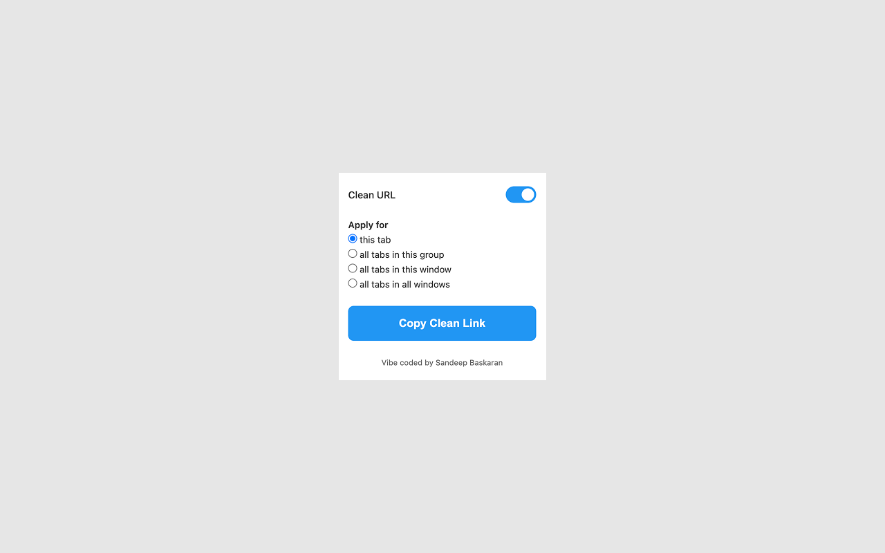

# Copy Clean URL

A Chrome extension for cleaning and copying URLs from one tab, multiple tabs, tab groups, windows, or every link on a page. It can also extract URLs from pasted text and open them as tabs.



## Install

### 1. Chrome Web Store

[**Install Copy Clean URL from the Chrome Web Store**](https://chromewebstore.google.com/detail/copy-clean-url/akfbdjbkancpbebcofcfibmfoaoigmbn)

This is the easiest option and receives updates automatically.

### 2. Load unpacked

1. Download this repository or clone it:

   ```bash
   git clone https://github.com/SandeepBaskaran/copy-clean-URL.git
   ```

2. Open `chrome://extensions/`.
3. Enable **Developer mode**.
4. Select **Load unpacked** and choose the repository folder.

## Features

- Copy URLs from the current tab, selected tabs, current tab group, current window, all browser windows, or all links on the current page.
- Preview URLs before copying and see how many links will be copied.
- Remove query parameters and fragments while preserving the essential YouTube video ID.
- Copy from the popup, the right-click context menu, or `Ctrl+Shift+L` (`Cmd+Shift+L` on macOS).
- Extract standard URLs, `www.` links, plain domains, and concatenated URLs from pasted text.
- Deduplicate imported URLs, clean and copy them, or open them as tabs with optional tab grouping.
- Save cleaning and scope preferences with Chrome Sync.

URL processing happens locally. The extension contains no analytics or external service calls.

## Changelog

### 1.2.1

- Preserved YouTube `v` parameters so different selected videos remain valid and distinct after cleaning.
- Shared the same URL-cleaning logic between the popup and background service worker.
- Added regression tests for URL cleaning and the selected-tabs workflow.

### 1.2.0

- Limited the all-windows scope to normal Chrome windows.
- Kept incognito tabs isolated to the active incognito window.

### 1.1.0

- Added the Export and Import workflows.
- Added bulk URL extraction, deduplication, tab opening, and optional tab grouping.

## Development

The extension uses Manifest V3 and does not require a build step.

```bash
npm test
npm run lint
npm run build
```

Chrome blocks clipboard and page-access operations on protected pages such as `chrome://` URLs. Test those actions from a regular webpage.

## License

MIT
